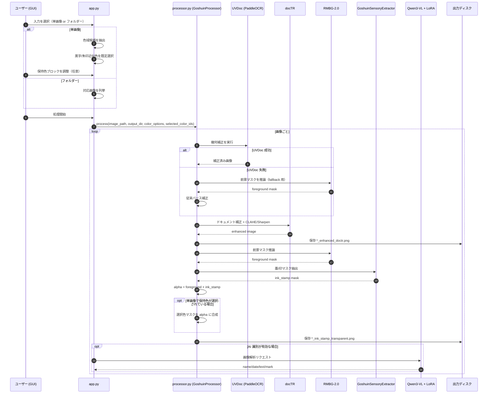

# GoshuinScan-OSS
[English](README_en.md)

御朱印のための AI デジタルアーカイブ化ツール

## 機能
Python GUI を使用して御朱印の写真を処理します：
1. **単画像 / フォルダー一括処理**：1 枚の画像または画像フォルダーを入力として選択でき、フォルダー選択時は中の対応画像を自動でまとめて処理します。
2. **幾何補正（UVDoc）**：PaddleOCR の UVDoc モジュールを使用して、撮影時の傾き・パース歪みを補正します（失敗時は従来の RMBG ベース補正にフォールバック）。
3. **ドキュメント補正**：docTR と古典的な画像補正アルゴリズム（CLAHE およびシャープネス）を組み合わせ、残りの微小な傾きを修正し、コントラストを強化します。
4. **背景除去とインク抽出**：RMBG-2.0 の前景マスクと `GoshuinSensoryExtractor` を合成し、和紙背景を透過化した PNG を出力します。
5. **保持色選択（単画像時）**：画像選択後に色域候補を抽出し、黒字・朱印に近い色を既定選択します。ユーザーが色ブロックを ON/OFF すると、最終透過時にその色域を保持できます（入力画像自体は変更しません）。

## 現在の処理フロー


## 必須環境
- Python 3.10+
- Windows / Linux / macOS
- NVIDIA GPU 推奨（CUDA が自動的に使用されます）

## インストール
```bash
python -m venv .venv
# Windows
.venv\Scripts\activate
# Linux/macOS
source .venv/bin/activate

pip install -r requirements.txt
```

> 初回実行時に UVDoc / docTR / RMBG-2.0 のモデル重みがダウンロードされるため、インターネット接続が必要です。

## PaddlePaddle (UVDoc 実行に必須)
`paddleocr` に加えて `paddlepaddle` / `paddlepaddle-gpu` の導入が必要です。

例（GPU 環境）:

```powershell
python -m pip install paddlepaddle-gpu==3.2.0 -i https://www.paddlepaddle.org.cn/packages/stable/cu126/
```

> Windows + NVIDIA 50 シリーズ GPU は PaddleOCR 公式の専用 Wheel 案内を確認してください:  
> https://www.paddleocr.ai/v3.3.0/en/version3.x/installation.html

Hugging Face に接続できない環境では、Paddle モデル取得元を BOS に切替できます:

```powershell
$env:PADDLE_PDX_MODEL_SOURCE = "BOS"
```

## 実行方法
```bash
python app.py
```

## LoRA モデル設定 (.env)
AI 識別（LoRA）を使う場合は、プロジェクトルートの `.env` でパスを設定してください。

```powershell
Copy-Item .env.example .env
```

`.env` の例:

```env
LORA_MODEL_PATH=K:\Qwen3-VL-4B-Instruct
LORA_ADAPTER_PATH=K:\qwen3vl-train\output\goshuin_lora_v1
```

## Hugging Face 認証 (RMBG-2.0 の利用に必須)
`briaai/RMBG-2.0` は gated model（アクセス制限付きモデル）のため、アクセス権の申請が必要です。

1. 以下のリンクにアクセスし、アクセス権を申請してください: `https://huggingface.co/briaai/RMBG-2.0`
2. `hf` コマンドでログインします（推奨）:

```powershell
.\.venv\Scripts\hf auth login
```

> **fine-grained token** を使用する場合は、トークンの設定で `Read access to public gated repositories you can access` を有効にしてください。そうしないと `403 Forbidden` エラーが発生します。

環境変数を使用することもできます:

```powershell
$env:HF_TOKEN = "hf_xxx"
```

まだ `RMBG-2.0` のアクセス権を取得していない場合、一時的に公開モデルに切り替えることも可能です:

```powershell
$env:RMBG_MODEL_ID = "briaai/RMBG-1.4"
```

## GUI の使い方
1. 入力を指定します（どちらか一方）。
   - `画像を選択`：単画像処理
   - `画像フォルダー` の `フォルダーを選択`：フォルダー一括処理
2. `出力フォルダー` の `フォルダーを選択` をクリックして、保存先を指定します。
3. 単画像処理時のみ、保持色ブロックが表示されます（黒字・朱印近似色は既定で選択済み）。
4. 任意：`GPU (CUDA) を使用`、`AI 識別 (LoRA モデル)` を有効化します。
5. `処理開始` をクリックします。

対応拡張子: `.jpg .jpeg .png .bmp .webp .tif .tiff`

処理が完了すると、指定した出力ディレクトリに以下のファイルが生成されます：
- `*_enhanced_doctr.png`：UVDoc 幾何補正 + docTR 補正済みの画像
- `*_ink_stamp_transparent.png`：墨/印抽出結果の透過背景 PNG（保持色選択がある場合は該当色域も保持）
