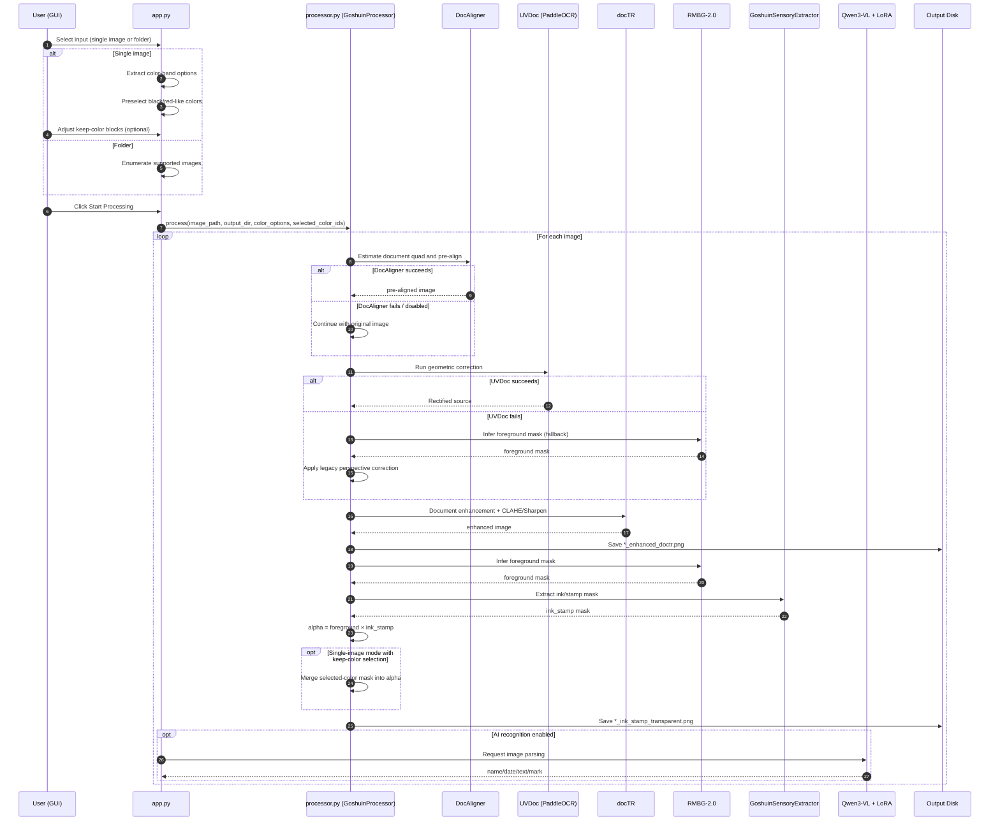

# GoshuinScan-OSS
[日本語](README.md)

AI-Powered Digital Archiving Tool for Goshuin (御朱印)

## Features
Process Goshuin photos easily using a Python GUI:
1. **Single Image / Folder Batch Processing**: You can select either one image or an input folder. If a folder is selected, all supported images in that folder are processed automatically.
2. **Geometric Rectification (DocAligner + UVDoc)**: First estimates a document quadrilateral with DocAligner for pre-alignment, then applies UVDoc for finer correction (with automatic fallback to the legacy RMBG-based correction when UVDoc fails).
3. **Document Enhancement**: Combines docTR with classic algorithms (CLAHE and unsharp masking) to fix remaining minor alignment issues and boost contrast.
4. **Background Removal & Ink Extraction**: Combines RMBG-2.0 foreground masking with `GoshuinSensoryExtractor` to remove Washi-like background and output transparent PNG.
5. **Keep-Color Selection (Single Image Only)**: After selecting one image, the app extracts color bands and preselects black-ink/red-stamp-like colors by default. Toggling color blocks only affects final alpha composition and does not overwrite the input image.

## Current Processing Flow


## Requirements
- Python 3.10+
- Windows / Linux / macOS
- NVIDIA GPU highly recommended (CUDA is used automatically if available)

## Installation
```bash
python -m venv .venv
# Windows
.venv\Scripts\activate
# Linux/macOS
source .venv/bin/activate

pip install -r requirements.txt
```

> The script will download UVDoc / docTR / RMBG-2.0 model weights on first run. Ensure you have a stable internet connection.

## PaddlePaddle (Required by UVDoc)
In addition to `paddleocr`, you must install `paddlepaddle` / `paddlepaddle-gpu`.

## DocAligner (Recommended)
`docaligner` is added to strengthen Stage-1 geometric correction and is enabled by default.

```powershell
python -m pip install docaligner-docsaid
python -m pip install onnxruntime
```
Step 1: Install libjpeg-turbo
On Ubuntu/Linux:
Install the development package using apt:
sudo apt-get update
sudo apt-get install -y libturbojpeg-dev nasm
Alternatively, for a specific version, download and build from source:
wget https://sourceforge.net/projects/libjpeg-turbo/files/2.0.x/libjpeg-turbo-2.0.2.tar.gz
tar -zxvf libjpeg-turbo-2.0.2.tar.gz
cd libjpeg-turbo-2.0.2
mkdir build && cd build
cmake -G"Unix Makefiles" ..
make -j8
sudo make install
sudo cp -rvf /opt/libjpeg-turbo/lib64/* /lib/
This ensures the library is installed in a standard location where PyTurboJPEG can find it. 

On Windows:
Download the official libjpeg-turbo installer (e.g., vc64.exe or gcc64.exe) from the libjpeg-turbo website.
Install using default settings.
Ensure the installation path is added to your system's PATH environment variable so PyTurboJPEG can locate the DLLs. 

Step 2: Install PyTurboJPEG
After installing libjpeg-turbo, install the Python wrapper:
pip install PyTurboJPEG
Ensure that the version of PyTurboJPEG matches your libjpeg-turbo version:
PyTurboJPEG 2.0+ requires libjpeg-turbo 3.0+
For libjpeg-turbo 2.x, use PyTurboJPEG 1.x. 

Step 3: Manually Specify the Library Path (if needed)
If PyTurboJPEG still cannot locate the library automatically, you can specify the path manually in Python:
from turbojpeg import TurboJPEG
jpeg = TurboJPEG("/path/to/libturbojpeg.so")  # Linux
# or
jpeg = TurboJPEG("C:\\path\\to\\turbojpeg.dll")  # Windows
Replace the path with the actual location of the installed library. 
In this project, you can also set `.env` -> `PYTURBOJPEG_LIBRARY_PATH` and the app will inject
`TURBOJPEG` / `TURBOJPEG_LIB` automatically at startup.
Github
Step 4: Verify Installation
Test the installation with a simple decode:
from turbojpeg import TurboJPEG
jpeg = TurboJPEG()
with open("test.jpg", "rb") as f:
image = jpeg.decode(f.read())
print("Image decoded successfully")
If no errors occur, PyTurboJPEG is correctly linked to the TurboJPEG library.


You can tune behavior with environment variables:

```powershell
$env:ENABLE_DOCALIGNER = "1"          # set 0 to disable
$env:DOCALIGNER_MIN_SCORE = "0.20"    # minimum mean corner confidence
$env:DOCALIGNER_MIN_AREA_RATIO = "0.002"  # minimum detected quad area ratio
$env:DOCALIGNER_EXPAND_RATIO = "0.03" # outward expansion to reduce edge clipping
```

Example (GPU):

```powershell
python -m pip install paddlepaddle-gpu==3.2.0 -i https://www.paddlepaddle.org.cn/packages/stable/cu126/
```

> For Windows + NVIDIA 50-series GPUs, follow the official special wheel guidance:  
> https://www.paddleocr.ai/v3.3.0/en/version3.x/installation.html

If your environment cannot reach Hugging Face, switch Paddle model source to BOS:

```powershell
$env:PADDLE_PDX_MODEL_SOURCE = "BOS"
```

## Usage
```bash
python app.py
```

## LoRA Model Config (.env)
If you want to use AI recognition (LoRA), configure paths in the project-root `.env` file.

```powershell
Copy-Item .env.example .env
```

Example `.env`:

```env
LORA_MODEL_PATH=K:\Qwen3-VL-4B-Instruct
LORA_ADAPTER_PATH=K:\qwen3vl-train\output\goshuin_lora_v1
PYTURBOJPEG_LIBRARY_PATH=C:\libjpeg-turbo-gcc64\bin\libturbojpeg.dll
```

## Hugging Face Authentication (Required for RMBG-2.0)
`briaai/RMBG-2.0` is a gated model, meaning you need to agree to their terms and request access.

1. Open this link and request access: `https://huggingface.co/briaai/RMBG-2.0`
2. Log in using the `hf` CLI (recommended):

```powershell
.\.venv\Scripts\hf auth login
```

> If you are using a **fine-grained token**, make sure to enable `Read access to public gated repositories you can access` in your token settings. Otherwise, you will encounter a `403 Forbidden` error.

Alternatively, you can provide your token via an environment variable:

```powershell
$env:HF_TOKEN = "hf_xxx"
```

If you haven't been granted access to `RMBG-2.0` yet, you can temporarily switch to an older, public model:

```powershell
$env:RMBG_MODEL_ID = "briaai/RMBG-1.4"
```

## How to Use the GUI
1. Choose input (one of the following):
   - `画像を選択` (Select Image) for single-image processing
   - `画像フォルダー` -> `フォルダーを選択` for folder batch processing
2. Choose output by `出力フォルダー` -> `フォルダーを選択`.
3. For single-image mode, keep-color blocks appear automatically (black/red-like colors are preselected by default).
4. Optional: enable `GPU (CUDA) を使用` and `AI 識別 (LoRA モデル)`.
5. Click `処理開始` (Start Processing).

Supported file extensions: `.jpg .jpeg .png .bmp .webp .tif .tiff`

After processing is complete, the following files will be generated in your output directory:
- `*_enhanced_doctr.png`: DocAligner+UVDoc-rectified + docTR-enhanced image.
- `*_ink_stamp_transparent.png`: Transparent PNG of extracted ink/stamp regions (plus user-selected keep-color regions, if any).
