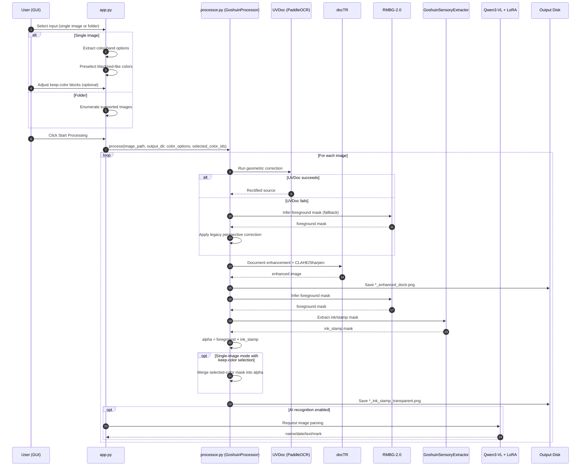

# GoshuinScan-OSS
[日本語](README.md)

AI-Powered Digital Archiving Tool for Goshuin (御朱印)

## Features
Process Goshuin photos easily using a Python GUI:
1. **Single Image / Folder Batch Processing**: You can select either one image or an input folder. If a folder is selected, all supported images in that folder are processed automatically.
2. **Geometric Rectification (UVDoc)**: Uses PaddleOCR's UVDoc module to correct tilt/perspective distortion (with automatic fallback to the legacy RMBG-based correction when UVDoc fails).
3. **Document Enhancement**: Combines docTR with classic algorithms (CLAHE and unsharp masking) to fix remaining minor alignment issues and boost contrast.
4. **Background Removal & Ink Extraction**: Combines RMBG-2.0 foreground masking with `GoshuinSensoryExtractor` to remove Washi-like background and output transparent PNG.
5. **Keep-Color Selection (Single Image Only)**: After selecting one image, the app extracts color bands and preselects black-ink/red-stamp-like colors by default. Toggling color blocks only affects final alpha composition and does not overwrite the input image.


## Processing Flow


## Requirements
- Python 3.10+
- Windows / Linux / macOS
- NVIDIA GPU highly recommended (CUDA is used automatically if available)

## Installation
```bash
python -m venv .venv
# Windows
.venv\Scripts\activate
# Linux/macOS
source .venv/bin/activate

pip install -r requirements.txt
```

> The script will download UVDoc / docTR / RMBG-2.0 model weights on first run. Ensure you have a stable internet connection.

## PaddlePaddle (Required by UVDoc)
In addition to `paddleocr`, you must install `paddlepaddle` / `paddlepaddle-gpu`.

Example (GPU):

```powershell
python -m pip install paddlepaddle-gpu==3.2.0 -i https://www.paddlepaddle.org.cn/packages/stable/cu126/
```

> For Windows + NVIDIA 50-series GPUs, follow the official special wheel guidance:  
> https://www.paddleocr.ai/v3.3.0/en/version3.x/installation.html

If your environment cannot reach Hugging Face, switch Paddle model source to BOS:

```powershell
$env:PADDLE_PDX_MODEL_SOURCE = "BOS"
```

## Usage
```bash
python app.py
```

## LoRA Model Config (.env)
If you want to use AI recognition (LoRA), configure paths in the project-root `.env` file.

```powershell
Copy-Item .env.example .env
```

Example `.env`:

```env
LORA_MODEL_PATH=K:\Qwen3-VL-4B-Instruct
LORA_ADAPTER_PATH=K:\qwen3vl-train\output\goshuin_lora_v1
```

## Hugging Face Authentication (Required for RMBG-2.0)
`briaai/RMBG-2.0` is a gated model, meaning you need to agree to their terms and request access.

1. Open this link and request access: `https://huggingface.co/briaai/RMBG-2.0`
2. Log in using the `hf` CLI (recommended):

```powershell
.\.venv\Scripts\hf auth login
```

> If you are using a **fine-grained token**, make sure to enable `Read access to public gated repositories you can access` in your token settings. Otherwise, you will encounter a `403 Forbidden` error.

Alternatively, you can provide your token via an environment variable:

```powershell
$env:HF_TOKEN = "hf_xxx"
```

If you haven't been granted access to `RMBG-2.0` yet, you can temporarily switch to an older, public model:

```powershell
$env:RMBG_MODEL_ID = "briaai/RMBG-1.4"
```

## How to Use the GUI
1. Choose input (one of the following):
   - `画像を選択` (Select Image) for single-image processing
   - `画像フォルダー` -> `フォルダーを選択` for folder batch processing
2. Choose output by `出力フォルダー` -> `フォルダーを選択`.
3. For single-image mode, keep-color blocks appear automatically (black/red-like colors are preselected by default).
4. Optional: enable `GPU (CUDA) を使用` and `AI 識別 (LoRA モデル)`.
5. Click `処理開始` (Start Processing).

Supported file extensions: `.jpg .jpeg .png .bmp .webp .tif .tiff`

After processing is complete, the following files will be generated in your output directory:
- `*_enhanced_doctr.png`: UVDoc-rectified + docTR-enhanced image.
- `*_ink_stamp_transparent.png`: Transparent PNG of extracted ink/stamp regions (plus user-selected keep-color regions, if any).
